# Team project NASDAQ Stock Market

**Project Description:** Data Science analysis of the NASDAQ Index 100 regarding price variations, stock volume and financial data from companies.

**Web page:** In the following link [Page](https://coding-stockmarket-2020.herokuapp.com/)

***Team:*** Abraham Calderon, Bernardo Jardon, Martin Jaramillo and Odin Del Toro.

**Objectives:** Advice final users of it is a good decision to invest using ETF or Index. Benchmark of the NASDAQ Index and ETF QQQ reviewing the correlation between them and create a trade pair algorithm with Quantopian libraries that replicate the Index considering a leverage of one unit. Create dashboards and Machine Learning models that advice the final user in the investment strategy by comparing companies. The investment strategy considers balance sheet, financial data, risk evaluation and expected returns of the NASDAQ Index and prediction with forecasting techniques of price variation for chosen stocks.

***Dataset:*** The data is extracted from IEX Cloud and Quantopian open sources

***Datasets premises:***  
* Acummulated data 5 years.
* Data segmented by 9 sectors, 39 industries and 100 companies.

***Dashboards:***  
* The dashboards are stored in the following link
[Stock Market](https://public.tableau.com/profile/odin.efren.del.toro.reyna#!/vizhome/StockMarketNASDAQ/DashboardPriceTrack)
[Financials](https://public.tableau.com/profile/odin.efren.del.toro.reyna#!/vizhome/NASDAQFinancialsFiscalDate2019-2020/DashboardFinancials)

***Quantopian:*** The data used is exclusive from the platform in the following link
[Quantopian](https://www.quantopian.com/)

***API IEX Cloud premises:***  
* The data is extracted from the API in the following link
[IEX](https://iexcloud.io/?gclid=Cj0KCQjw7sz6BRDYARIsAPHzrNLtRqK0vB8I_eTsoPRUBp8tH5ZjMdPxsWyTjNqgkZw813rQ0ZpjnGUaAjLPEALw_wcB)

Summary statistics and data visualizations created using Python (Pandas, Matplotlib, Seaborn, NumPy, Flask, SQLAlchemy, Scikit-learn), Tableau and Javascript (chart.js).
Stored data in databases (PostgreSQL), build website (HTML/CSS, SASS, Node.js) and hosting (Heroku).

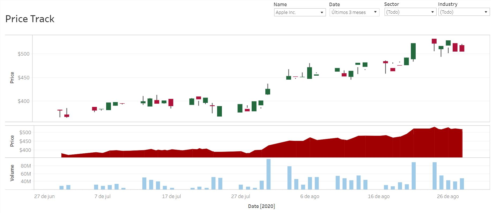
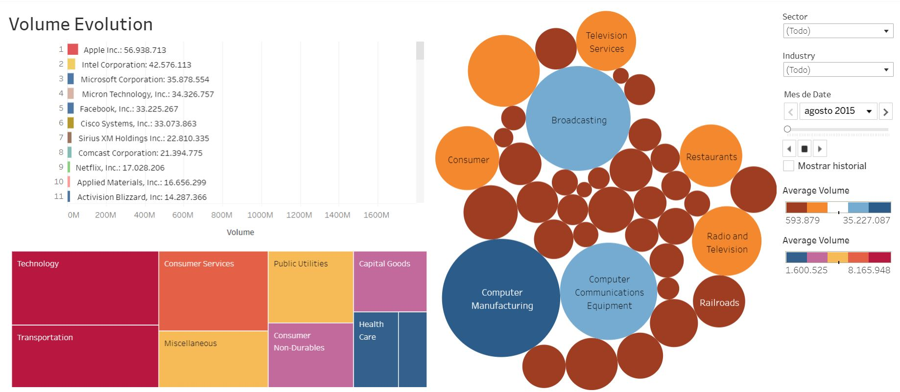
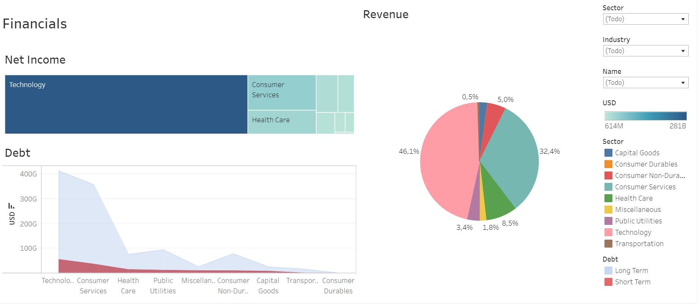
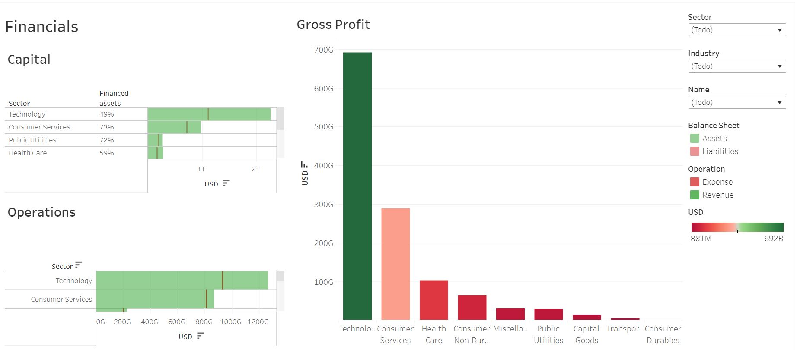
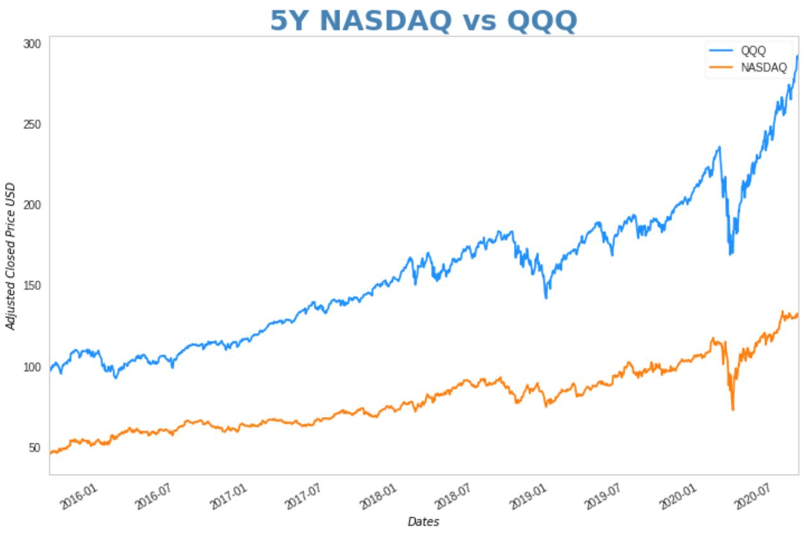
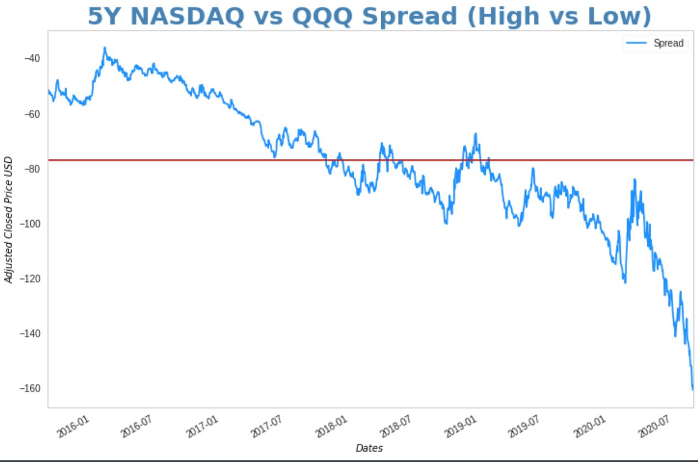
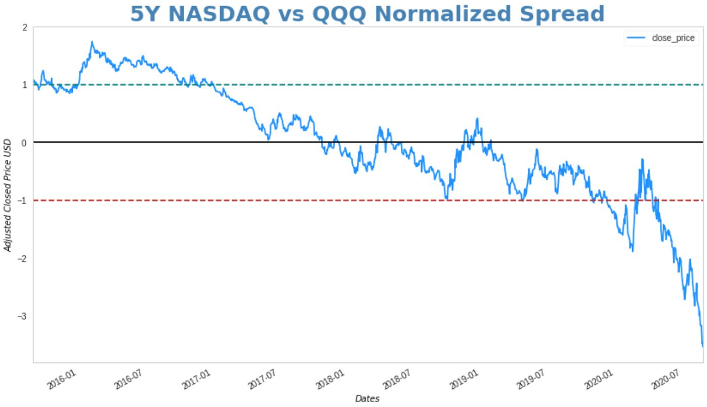
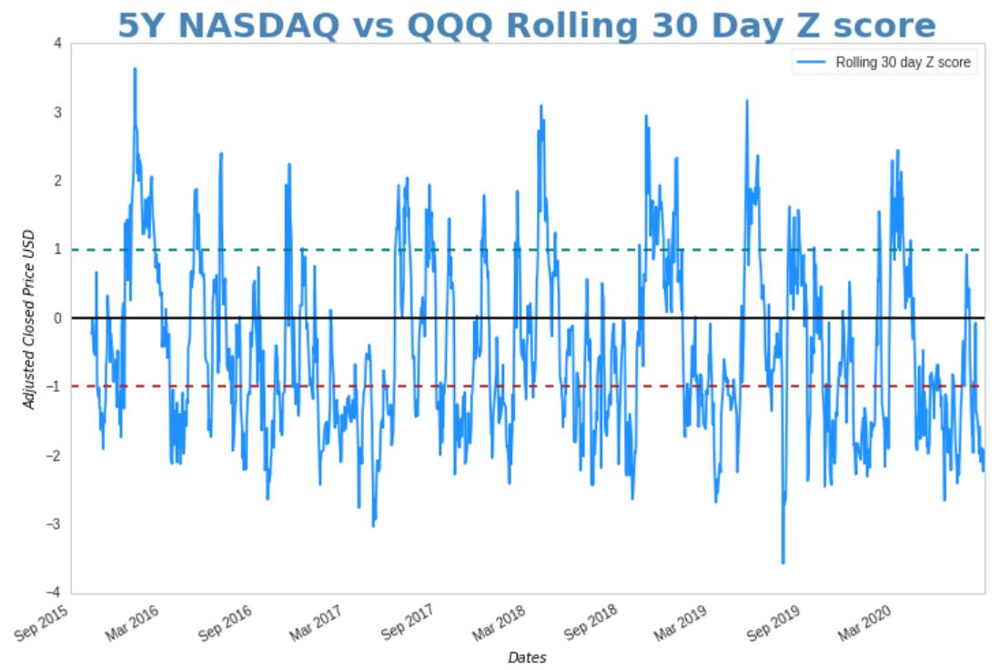
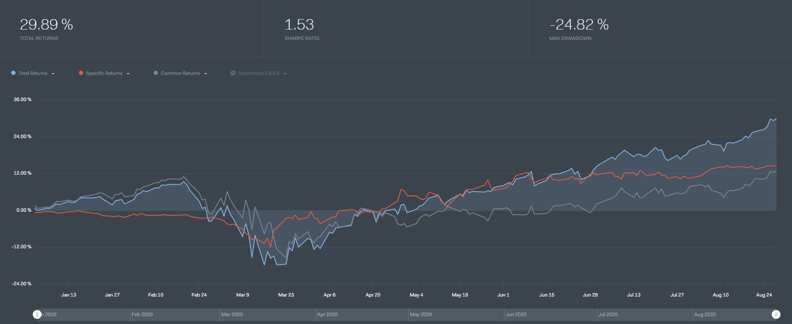
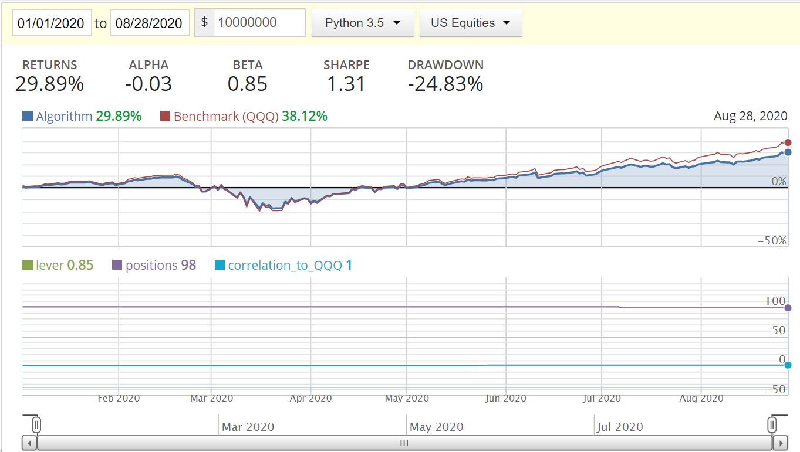
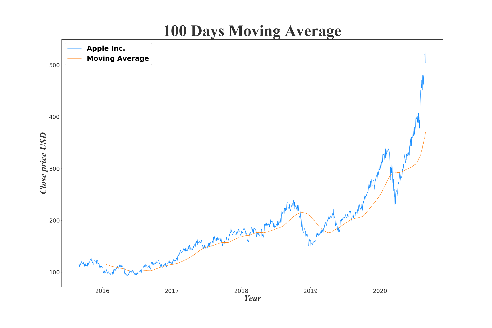
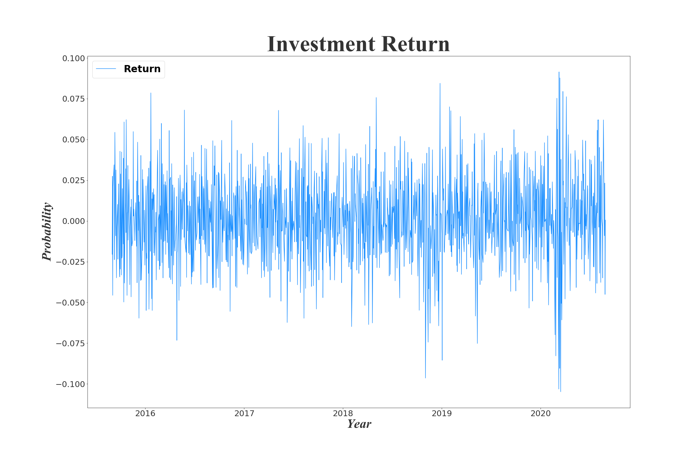
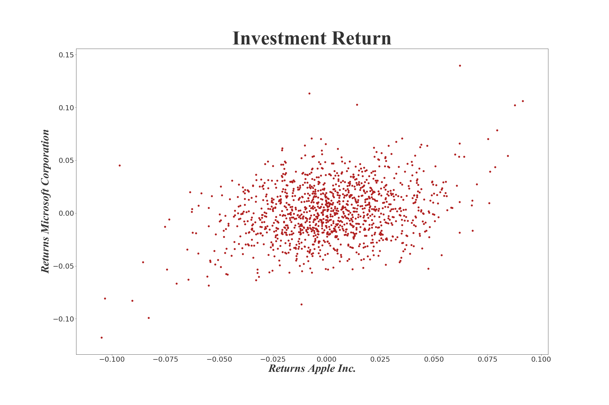
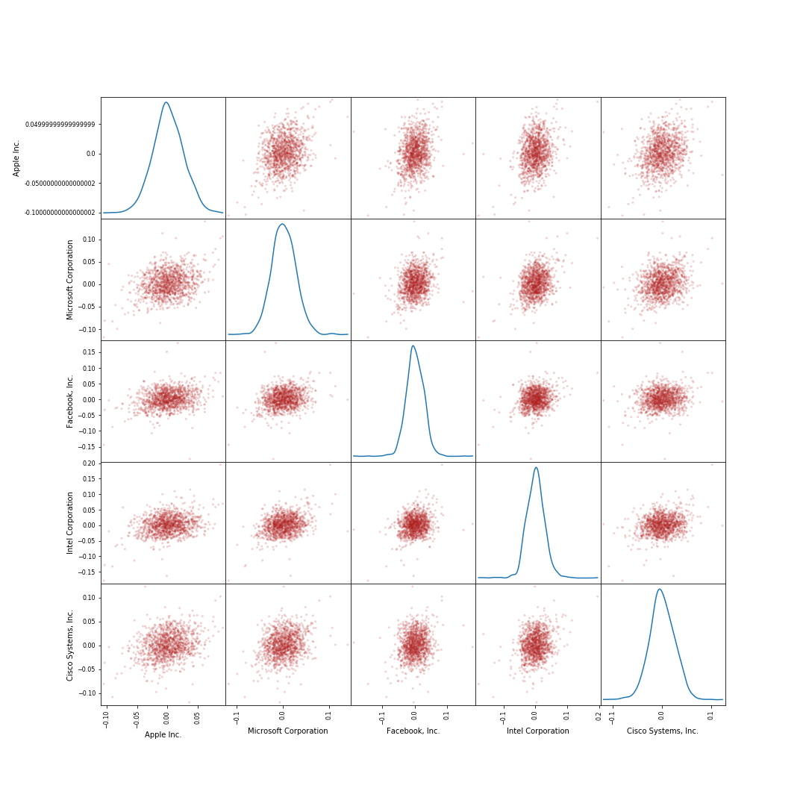
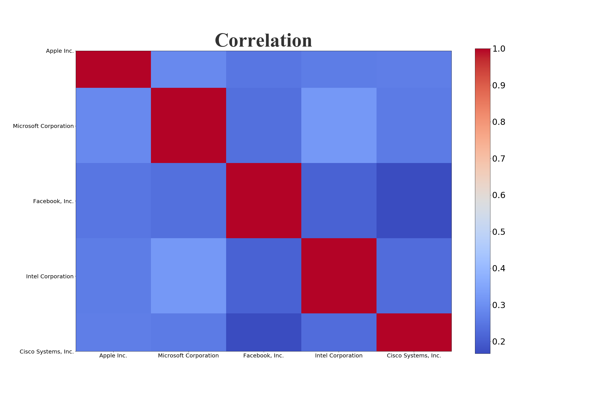
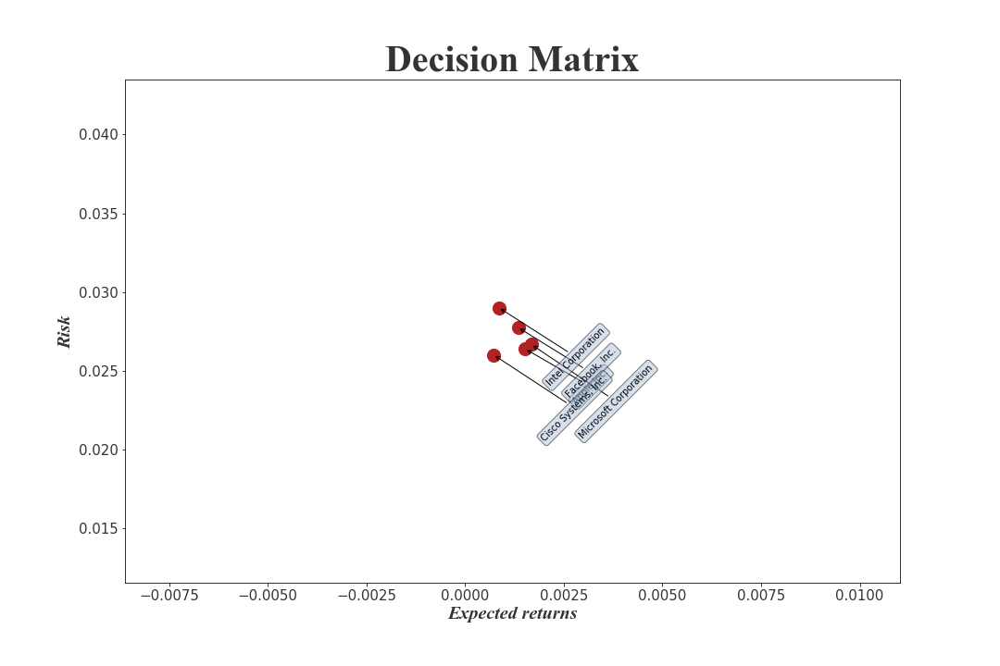
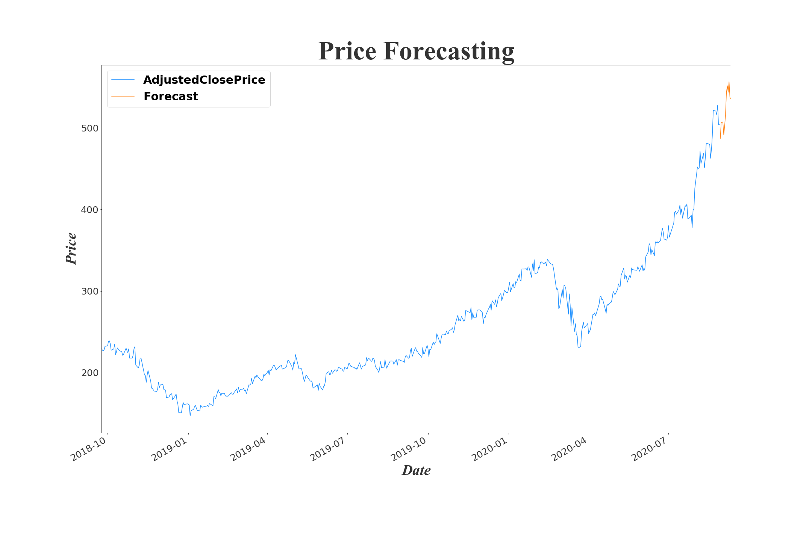
